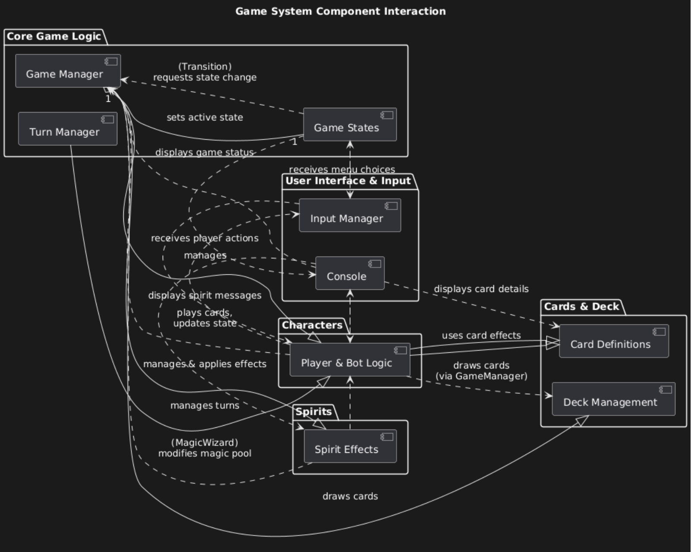
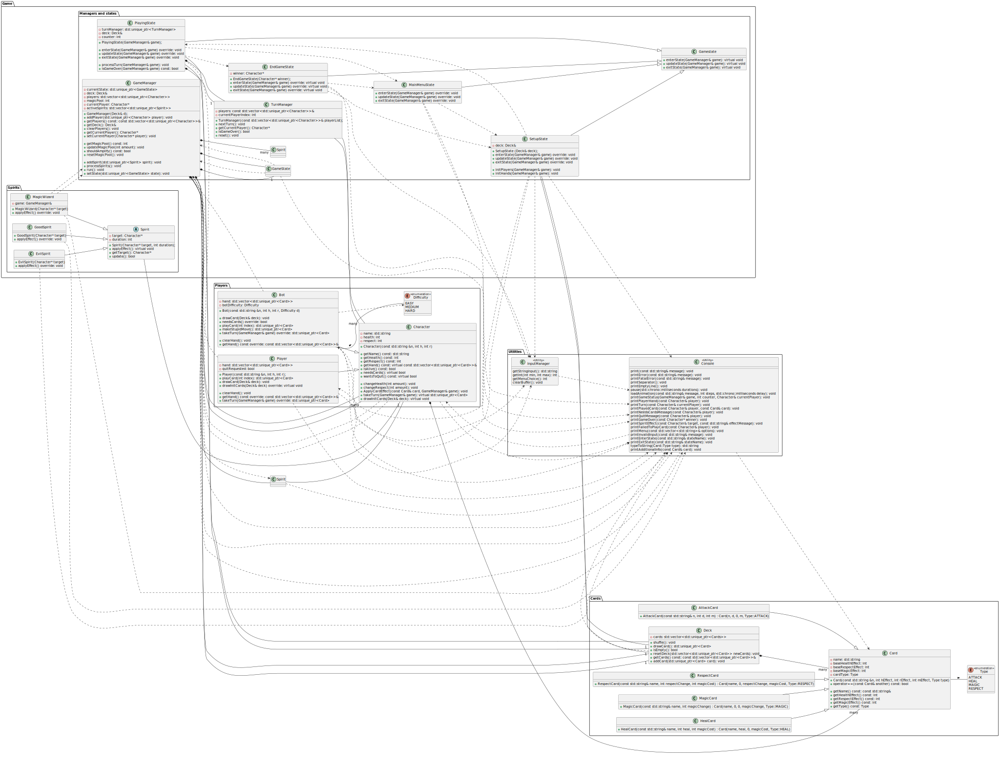

# Architectural Design of LabWork2.0

## Table of contents
1. [System Overview](#1-system-overview)
2. [System Requirements and Use Cases](#2-system-requirements-and-use-cases)
    * [2.1. Functional Requirements (FR)](#2.1-functional-requirements-(FR))
    * [2.2. Non-Functional Requirements (NFR)](#2.2-non-functional-requirements-(NFR))
    * [2.3. Use Cases (UC)](#2.3-use-cases-(UC))
3. [Component Diagram with Description](#3-component-diagram-with-description)
4. [Class Diagram with Description](#4-class-diagram-with-description)
5. [Test Scenarios](#5-test-scenarios)
    * [5.1. Card Test](#5.1-card-test)
    * [5.2. Character Test](#5.2-character-test)
    * [5.3. Easy and Medium Bot Test](#5.3-easy-and-medium-bot-test)
    * [5.4. GameManager Test](#5.4-gamemanager-test)
    * [5.5. Hard Bot Choose State Test](#5.5-hard-bot-choose-state-test)
    * [5.6. Spirits Test](#5.6-spirits-test)
    * [5.7. Turn Test](#5.7-turn-test)
    * [5.8. Completion Criteria](#5.8-completion-criteria)

## 1. System Overview

The "LabWork2" system is a console-based turn-based combat game between players and bots. The core gameplay revolves around the strategic use of various card types (attack, heal, magic, respect) and managing in-game resources (health, respect points, magic pool). The game incorporates turn-based logic, game state management (win/loss conditions), diverse bot AI behaviors, and interaction with "Spirit" effects.

**Key System Entities:**

* **Players/Characters:** Participants in the game, possessing health, respect points, and a hand of cards. They can be human (`Player`) or AI-controlled (`Bot`).
* **Cards:** The primary tools for interaction within the game. They have various effects (health, magic, respect) and types (Attack, Heal, Magic, Respect).
* **Deck:** Contains a set of cards from which players can draw into their hand.
* **Spirits:** Objects that apply effects to players (e.g., `EvilSpirit`, `GoodSpirit`, `MagicWizard`).
* **Game Manager (`GameManager`):** The1central component responsible for managing the overall game state, magic pool, player list, and their interactions.
* **Turn Manager (`TurnManager`):** Responsible for the logic of switching turns between players and determining game conclusion.
* **Bot Game Logic:** Defines the behavior of bots with varying difficulties (Easy, Medium, Hard) when choosing actions and cards.

## 2. System Requirements and Use Cases

### 2.1. Functional Requirements (FR)

* **FR.1.1. Player Management:** The system allows the creation of players (human and bot) with defined initial characteristics (name, health, respect points).
* **FR.1.2. Card Management:** The system supports different types of cards (heal, attack, magic and respect) with defined effect (health, respect and magic pool).
* **FR.1.3. Deck Management:** The deck supports various methods needed in the game: adding cards, checking for emptiness, drawing cards and shuffling.
* **FR.1.4. Game Management:** The system manages the overall game session, including:
    * Adding players to the game.
    * Updating the magic pool.
    * Determing the current manager and build the turn order.
    * Checking for win or loss condition.
* **FR.1.5. Player-Card interaction:** A player should be able to play a card from their hand and the card applies it's effect on the player, opponent or game's magic pool.
* **FR.1.6. Bot Behavior:** 
    * **FR.1.6.1. Easy Bot:** Bot plays first card in their hand.
    * **FR.1.6.2. Medium Bot:** Bot makes a decision which card to play based on key game characteristics (own health, opponent's health etc.).
    * **FR.1.6.3. Hard Bot:** Bot firstly makes a decision which state to choose (Aggressive, Defensive etc.) based on key game triggers (own health, opponent's health etc.), then it assigns every card in their hand defined score based on Bot's state and then plays the card which has the greatest score.
* **FR.1.7. Spirit Effects:** The system supports the application of 'Spirit' effects (GoodSpirit, EvilSpirit, MagicWizard), which influences Player's (or Bot's) health and generous magic pool.

### 2.2. Non-Functional Requirements (NFR)

* **NFR.2.1. Platform:** The system must be runnable on **Ubuntu 22.04**
* **NFR.2.2. Build System:** The project must be built using **Make** and **CMake** (for building external dependencies like Google Test/Mock at CI).
* **NFR.2.3. Testing:** The system must be covered by unit tests using the **Google Test** and **Google Mock** frameworks.
* **NFR.2.4. Language:** The project must be implemented in **C++17** or later.

### 2.3. Use Cases (UC)

**UC.1. Player Takes a Turn:**
* **Precondition:** The game is active, current player is determined.
* **Actions:** 
    1. The system presents the player available actions: leave, choose card or get help for the card.
    2. The player selects a card from their hand.
    3. The system applies the effect of selected card.
    4. Game's magic pool is updated according to the card's effect.
    5. (If Bot) The bot chooses card based on it's difficulty and other game characteristics.
    6. (Optional) A spirit effect triggers.
* **Postcondition:** Player states and the magic pool are updated. The turn passes to the next player.

**UC.2. Determine Winner:**
* **Precondition:** A player's turn has concluded.
* **Actions:**
    1. The system checks the `isGameOver()` condition.
    2. If only one player remains alive, or all players are dead, the game ends.
    3. The system declares the winner (or a draw).
* **Postcondition:** The game has ended. It is proposed to the player if it wants to continue or leave.

**UC.3. Bot Chooses Action:**
* **Precondition:** It is the bot's turn.
* **Actions:**
    1.  The bot analyzes the current game state (its own health/respect, opponents' health/respect, magic pool, its hand).
    2.  The bot selects a strategic state (e.g., `CriticallyDefensive`, `MagicAdvantageBot`, `RespectFocus`, `Balance`).
    3.  The bot chooses the most suitable card from its hand, based on the selected strategy.
    4.  The bot applies the card's effect.
* **Postcondition:** The card is played, the magic pool is updated. The turn passes to the next player.

## 3. Component Diagram with Description

**Core Components:**

* **GameCore:**
    * **`GameManager`:** Manages the global game state (magic pool, player list), handles Spirit effects, determines `shouldAmplify` (magic amplification).
    * **`TurnManager`:** Manages turn order, determines the current player, checks game termination conditions (`isGameOver`).
* **Characters:**
    * **`Character` (Abstract):** Base class for all game participants, storing name, health, respect. Defines common methods (`changeHealth`, `changeRespect`, `applyCardEffect`, `drawInitCards`, `discardCard`, `useCard`, `IsAlive`, `takeTurn`, `needsCards`, `wantsToQuit`).
    * **`Player`:** Implementation of `Character` for human players.
    * **`Bot`:** Implementation of `Character` for AI opponents. Contains `chooseState` and `chooseCard` logic.
* **Cards:**
    * **`Card` (Abstract):** Base class for all cards, storing name, effects (health, magic, respect), type.
    * **`AttackCard`:** Reduces target's health, reduces user's magic.
    * **`HealCard`:** Increases user's health, reduces user's magic.
    * **`MagicCard`:** Influences the magic pool, reduces user's health or nothing.
    * **`RespectCard`:** Increases respect points, reduces user's magic.
* **Deck:** Manages the card deck: adding, drawing, shuffling.
* **Spirits:**
    * **`Spirit` (Abstract):** Base class for spirit effects.
    * **`EvilSpirit`:** Deals damage to a player.
    * **`GoodSpirit`:** Heals a player.
    * **`MagicWizard`:** Influences the magic pool.
* **Utilities:**
    * **Tests/Mocks:** Helper classes and functions for testing, including mocks (`MockGameManager`).

**Component Interactions:**

* `GameManager` interacts with `TurnManager` (for turn control), `Characters` (to access players), `Deck` (for drawing cards), and `Spirits` (for applying effects).
* `TurnManager` interacts with `Characters` (to get the current player and check health) and `GameManager` (to determine win/loss).
* `Characters` (specifically `Player` and `Bot`) interact with `Card` (apply card effects) and `GameManager` (to update overall game state when playing cards).
* `Bot` has additional logic interacting with `GameManager` (for analyzing game state) and `Card` (for card selection).
* `Spirits` interact with `Character` (to modify health/respect) and `GameManager` (to modify the magic pool).
* `Deck` provides cards to `Characters`.

## 4. Class Diagram with Description

The system's core is structured around several key packages: `Cards`, `Players`, `Game` (further divided into `Managers and states` and `Spirits`), and `Utilities`.

### 4.1. `Cards` Package

This package encapsulates the logic and data structures related to the game's cards and the deck.

* **`Card`** (Abstract Class)
    * **Description:** The base class for all cards in the game, defining common properties and behaviors.
    * **Attributes:**
        * `name`: `std::string`
        * `baseHealthEffect`: `int`
        * `baseRespectEffect`: `int`
        * `baseMagicEffect`: `int`
        * `cardType`: `Type`
    * **Methods:**
        * `Card(const std::string &n, int hEffect, int rEffect, int mEffect, Type type)`: Constructor.
        * `operator==(const Card& another) const: bool`: Equality comparison for cards.
        * `getName() const: const std::string&`: Returns the card's name.
        * `getHealthEffect() const: int`: Returns the health effect value.
        * `getRespectEffect() const: int`: Returns the respect effect value.
        * `getMagicEffect() const: int`: Returns the magic effect value.
        * `getType() const: Type`: Returns the card's type.
* **`Type`** (Enumeration)
    * **Description:** Defines the possible categories for cards.
    * **Values:** `ATTACK`, `HEAL`, `MAGIC`, `RESPECT`
* **`AttackCard`**
    * **Description:** A concrete card type that applies damage.
    * **Methods:**
        * `AttackCard(const std::string& n, int d, int m) : Card(n, d, 0, m, Type::ATTACK)`: Constructor, initializes as an ATTACK card with damage (`d`) and magic cost (`m`).
* **`HealCard`**
    * **Description:** A concrete card type that restores health.
    * **Methods:**
        * `HealCard(const std::string& name, int heal, int magicCost) : Card(name, heal, 0, magicCost, Type::HEAL)`: Constructor, initializes as a HEAL card with healing amount (`heal`) and magic cost (`magicCost`).
* **`MagicCard`**
    * **Description:** A concrete card type that affects the game's magic pool.
    * **Methods:**
        * `MagicCard(const std::string& name, int magicChange) : Card(name, 0, 0, magicChange, Type::MAGIC)`: Constructor, initializes as a MAGIC card with magic change amount (`magicChange`).
* **`RespectCard`**
    * **Description:** A concrete card type that affects a character's respect points.
    * **Methods:**
        * `RespectCard(const std::string& name, int respectChange, int magicCost) : Card(name, 0, respectChange, magicCost, Type::RESPECT)`: Constructor, initializes as a RESPECT card with respect change (`respectChange`) and magic cost (`magicCost`).
* **`Deck`**
    * **Description:** Manages a collection of cards, providing functionality for shuffling, drawing, and adding cards.
    * **Attributes:**
        * `cards`: `std::vector<std::unique_ptr<Cards>>`: A collection of cards in the deck.
    * **Methods:**
        * `shuffle(): void`: Randomizes the order of cards in the deck.
        * `drawCard(): std::unique_ptr<Card>`: Removes and returns the top card from the deck.
        * `isEmpty(): bool`: Checks if the deck contains any cards.
        * `resetDeck(std::vector<std::unique_ptr<Card>> newCards): void`: Replaces the current deck with a new set of cards.
        * `getCards() const: const std::vector<std::unique_ptr<Card>>&`: Returns a constant reference to the cards in the deck.
        * `addCard(std::unique_ptr<Card> card): void`: Adds a card to the deck.
* **Relationships within `Cards`:**
    * `Deck` contains "many" `Card` objects (composition, indicated by `std::unique_ptr`).
    * `Card` has a dependency on `Type` enumeration.
    * `AttackCard`, `HealCard`, `MagicCard`, and `RespectCard` all inherit from `Card`.

### 4.2. `Players` Package

This package defines the base class for all participants in the game and its concrete implementations for human players and AI bots.

* **`Character`** (Abstract Class)
    * **Description:** The abstract base class for any entity that can participate in the game, possessing core attributes like health and respect, and capabilities like taking turns and applying card effects.
    * **Attributes:**
        * `name`: `std::string`
        * `health`: `int`
        * `respect`: `int`
    * **Methods:**
        * `Character(const std::string &n, int h, int r)`: Constructor.
        * `getName() const: std::string`: Returns the character's name.
        * `getHealth() const: int`: Returns the character's current health.
        * `getRespect() const: int`: Returns the character's current respect points.
        * `getHand() const: virtual const std::vector<std::unique_ptr<Card>>&`: Virtual method to get the character's hand of cards.
        * `isAlive() const: bool`: Checks if the character's health is greater than 0.
        * `needsCards(): virtual bool`: Virtual method to determine if the character needs to draw more cards.
        * `wantsToQuit() const: virtual bool`: Virtual method to check if the character wants to quit the game.
        * `changeHealth(int amount): void`: Modifies the character's health.
        * `changeRespect(int amount): void`: Modifies the character's respect points.
        * `ApplyCardEffect(const Card& card, GameManager& game): void`: Applies the effect of a given card, interacting with the `GameManager`.
        * `takeTurn(GameManager& game): virtual std::unique_ptr<Card>`: Virtual method for the character to take their turn.
        * `drawInitCards(Deck& deck): virtual void`: Virtual method for drawing initial cards at the start of the game.
* **`Player`**
    * **Description:** Represents a human-controlled player in the game.
    * **Attributes:**
        * `hand`: `std::vector<std::unique_ptr<Card>>`: The player's current hand of cards.
        * `quitRequested`: `bool`: Flag indicating if the player has requested to quit.
    * **Methods:**
        * `Player(const std::string &n, int h, int r)`: Constructor.
        * `playCard(int index): std::unique_ptr<Card>`: Plays a card from the hand at a specific index.
        * `drawCard(Deck& deck): void`: Draws a single card from the deck.
        * `drawInitCards(Deck& deck) override: virtual void`: Overrides the base method to draw initial cards.
        * `clearHand(): void`: Empties the player's hand.
        * `getHand() const override: const std::vector<std::unique_ptr<Card>>&`: Overrides to return the player's hand.
        * `takeTurn(GameManager& game) override: std::unique_ptr<Card>`: Overrides to implement human player turn logic.
* **`Bot`**
    * **Description:** Represents an AI-controlled opponent in the game, with varying levels of difficulty.
    * **Attributes:**
        * `hand`: `std::vector<std::unique_ptr<Card>>`: The bot's current hand of cards.
        * `botDifficulty`: `Difficulty`: The AI difficulty level of the bot.
    * **Methods:**
        * `Bot(const std::string &n, int h, int r, Difficulty d)`: Constructor.
        * `drawCard(Deck& deck): void`: Draws a single card from the deck.
        * `needsCards() override: bool`: Overrides to implement bot-specific logic for needing cards.
        * `playCard(int index): std::unique_ptr<Card>`: Plays a card from the hand at a specific index.
        * `makeStupidMove(): std::unique_ptr<Card>`: (Likely for Easy Bot) Makes a random or simple move.
        * `takeTurn(GameManager& game) override: std::unique_ptr<Card>`: Overrides to implement bot AI turn logic.
        * `clearHand(): void`: Empties the bot's hand.
        * `getHand() const override: const std::vector<std::unique_ptr<Card>>&`: Overrides to return the bot's hand.
* **`Difficulty`** (Enumeration)
    * **Description:** Defines the AI difficulty levels for bots.
    * **Values:** `EASY`, `MEDIUM`, `HARD`
* **Relationships within `Players`:**
    * `Bot` and `Player` both inherit from `Character`.
    * `Bot` has a dependency on the `Difficulty` enumeration.
    * `Character` contains "many" `Card` objects (composition, indicated by `std::unique_ptr` in hand).

### 4.3. `Game` Package

This package contains the core game logic, including managers for game state and turns, and the implementation of various spirit effects.

#### 4.3.1. `Managers and states` Sub-package

This sub-package manages the overall flow of the game and its different states.

* **`GameManager`**
    * **Description:** The central orchestrator of the game, managing players, the deck, the magic pool, active spirits, and the current game state.
    * **Attributes:**
        * `currentState`: `std::unique_ptr<GameState>`: The current state of the game (e.g., Main Menu, Playing).
        * `deck`: `Deck&`: A reference to the game's deck.
        * `players`: `std::vector<std::unique_ptr<Character>>`: A collection of all players in the game.
        * `magicPool`: `int`: The current value of the game's magic pool.
        * `currentPlayer`: `Character*`: A pointer to the character whose turn it currently is.
        * `activeSpirits`: `std::vector<std::unique_ptr<Spirit>>`: A collection of active spirit effects.
    * **Methods:**
        * `GameManager(Deck& d)`: Constructor, takes a reference to the game's deck.
        * `addPlayer(std::unique_ptr<Character> player): void`: Adds a new player to the game.
        * `getPlayers() const: const std::vector<std::unique_ptr<Character>>&`: Returns a constant reference to the list of players.
        * `getDeck(): Deck&`: Returns a reference to the game's deck.
        * `clearPlayers(): void`: Removes all players from the game.
        * `getCurrentPlayer(): Character*`: Returns a pointer to the current player.
        * `setCurrentPlayer(Character* player): void`: Sets the current player.
        * `getMagicPool() const: int`: Returns the current magic pool value.
        * `updateMagicPool(int amount): void`: Changes the magic pool by a given amount.
        * `shouldAmplify() const: bool`: Determines if card effects should be amplified based on the magic pool and current player.
        * `resetMagicPool(): void`: Resets the magic pool to its initial state (likely 0).
        * `addSpirit(std::unique_ptr<Spirit> spirit): void`: Adds a new spirit effect to the game.
        * `processSpirits(): void`: Applies effects of all active spirits and removes expired ones.
        * `run(): void`: The main game loop entry point.
        * `setState(std::unique_ptr<GameState> state): void`: Transitions the game to a new state.
* **`TurnManager`**
    * **Description:** Manages the sequence of turns among players and determines game-over conditions.
    * **Attributes:**
        * `players`: `const std::vector<std::unique_ptr<Character>>&`: A constant reference to the list of players managed by `GameManager`.
        * `currentPlayerIndex`: `int`: The index of the current player in the `players` vector.
    * **Methods:**
        * `TurnManager(const std::vector<std::unique_ptr<Character>>& playerList)`: Constructor.
        * `nextTurn(): void`: Advances the turn to the next active player.
        * `getCurrentPlayer(): Character*`: Returns a pointer to the character whose turn it is.
        * `isGameOver(): bool`: Checks if the game has ended (e.g., only one player left, or all dead).
        * `reset(): void`: Resets the turn manager's state.
* **`GameState`** (Abstract Class)
    * **Description:** The base class for all specific game states, defining an interface for state transitions.
    * **Methods:**
        * `enterState(GameManager& game): virtual void`: Called when entering this state.
        * `updateState(GameManager& game): virtual void`: Called periodically while in this state (game loop).
        * `exitState(GameManager& game): virtual void`: Called when exiting this state.
* **`MainMenuState`**
    * **Description:** Represents the game's main menu state.
    * **Methods:** Overrides `enterState`, `updateState`, `exitState` from `GameState`.
* **`SetupState`**
    * **Description:** Manages the initial setup of a new game, including player creation and hand distribution.
    * **Attributes:**
        * `deck`: `Deck&`: A reference to the game's deck.
    * **Methods:**
        * `SetupState (Deck& deck)`: Constructor.
        * `enterState(GameManager& game) override: void`: Overrides for state entry logic.
        * `updateState(GameManager& game) override: void`: Overrides for state update logic.
        * `exitState(GameManager& game) override: void`: Overrides for state exit logic.
        * `initPlayers(GameManager& game): void`: Initializes players for the game.
        * `initHands(GameManager& game): void`: Deals initial hands to players.
* **`PlayingState`**
    * **Description:** Represents the active gameplay state where turns are taken.
    * **Attributes:**
        * `turnManager`: `std::unique_ptr<TurnManager>`: Manages turns within this state.
        * `deck`: `Deck&`: A reference to the game's deck.
        * `counter`: `int`: (Likely) A turn counter or similar.
    * **Methods:**
        * `PlayingState(GameManager& game)`: Constructor.
        * `enterState(GameManager& game) override: void`: Overrides for state entry logic.
        * `updateState(GameManager& game) override: void`: Overrides for state update logic.
        * `exitState(GameManager& game) override: void`: Overrides for state exit logic.
        * `processTurn(GameManager& game): void`: Handles the logic for a single turn.
        * `isGameOver(GameManager& game) const: bool`: Checks if the game is over from this state's perspective.
* **`EndGameState`**
    * **Description:** Represents the state after the game has concluded, displaying the winner.
    * **Attributes:**
        * `winner`: `Character*`: A pointer to the winning character (or `nullptr` for a draw).
    * **Methods:**
        * `EndGameState(Character* winner)`: Constructor.
        * `enterState(GameManager& game) override: virtual void`: Overrides for state entry logic.
        * `updateState(GameManager& game) override: virtual void`: Overrides for state update logic.
        * `exitState(GameManager& game) override: virtual void`: Overrides for state exit logic.
* **Relationships within `Managers and states`:**
    * `MainMenuState`, `SetupState`, `PlayingState`, `EndGameState` all inherit from `GameState`.
    * `GameManager` aggregates a `GameState` (composition, `std::unique_ptr`).
    * `GameManager` aggregates "many" `Character` objects (composition, `std::unique_ptr`).
    * `GameManager` aggregates "many" `Spirit` objects (composition, `std::unique_ptr`).
    * `GameManager` is associated with one `Deck`.
    * `PlayingState` composes a `TurnManager`.
    * `PlayingState` and `SetupState` are associated with one `Deck`.
    * `TurnManager` aggregates "many" `Character` objects (constant reference).
    * Various states have dependencies on `GameManager` for state transitions and operations.
    * `SetupState` has dependencies on `Player` and `Bot` for creation.

#### 4.3.2. `Spirits` Sub-package

This sub-package defines the base class for spirit effects and their specific implementations.

* **`Spirit`** (Abstract Class)
    * **Description:** The base class for all temporary effects that can influence characters or the game state.
    * **Attributes:**
        * `target`: `Character*`: A pointer to the character affected by the spirit.
        * `duration`: `int`: The remaining duration of the spirit's effect.
    * **Methods:**
        * `Spirit(Character* target, int duration)`: Constructor.
        * `applyEffect(): virtual void`: Virtual method to apply the spirit's specific effect.
        * `getTarget(): Character*`: Returns the target character.
        * `update(): bool`: Updates the spirit's duration and returns `true` if still active, `false` otherwise.
* **`EvilSpirit`**
    * **Description:** A spirit that inflicts damage on its target.
    * **Methods:**
        * `EvilSpirit(Character* target)`: Constructor.
        * `applyEffect() override: void`: Overrides to apply damage.
* **`GoodSpirit`**
    * **Description:** A spirit that heals its target.
    * **Methods:**
        * `GoodSpirit(Character* target)`: Constructor.
        * `applyEffect() override: void`: Overrides to apply healing.
* **`MagicWizard`**
    * **Description:** A spirit that affects the game's magic pool.
    * **Attributes:**
        * `game`: `GameManager&`: A reference to the `GameManager` to modify the magic pool.
    * **Methods:**
        * `MagicWizard(Character* target)`: Constructor.
        * `applyEffect() override: void`: Overrides to modify the magic pool.
* **Relationships within `Spirits`:**
    * `EvilSpirit`, `GoodSpirit`, and `MagicWizard` all inherit from `Spirit`.
    * `Spirit` is associated with one `Character` (its target).
    * `MagicWizard` has a dependency on `GameManager`.

### 4.4. `Utilities` Package

This package provides helper classes for console I/O and general utility functions.

* **`Console`** (Utility Class with Static Methods)
    * **Description:** Provides static methods for all console output operations, ensuring consistent formatting and error reporting.
    * **Methods:**
        * `print(const std::string& message): void`
        * `printError(const std::string& message): void`
        * `printFatalError(const std::string& message): void`
        * `printSeparator(): void`
        * `printEmptyLine(): void`
        * `pause(std::chrono::milliseconds durations): void`
        * `loadAnimation(const std::string& message, int steps, std::chrono::milliseconds delay): void`
        * `printGameStatus(GameManager& game, int counter, Character& currentPlayer): void`
        * `printPlayerHand(const Character& player): void`
        * `printTurn(const Character& currentPlayer): void`
        * `printPlayedCard(const Character& player, const Card& card): void`
        * `printNeedsCardsMessage(const Character& player): void`
        * `printQuitMessage(const Character& player): void`
        * `printGameOver(const Character* winner): void`
        * `printSpiritEffect(const Character& target, const std::string& effectMessage): void`
        * `printFailedToPlayCard(const Character& player): void`
        * `printMenu(const std::vector<std::string>& options): void`
        * `printInvalidInput(const std::string& message): void`
        * `printEnterState(const std::string& stateName): void`
        * `printExitState(const std::string& stateName): void`
        * `typeToString(Card::Type type): std::string`
        * `printAdditionalInfo(const Card& card): void`
* **`InputManager`** (Utility Class with Static Methods)
    * **Description:** Provides static methods for handling user input from the console.
    * **Methods:**
        * `getStringInput(): std::string`
        * `getInt(int min, int max): int`
        * `getMenuChoice(): int`
        * `clearBuffer(): void`
* **Relationships within `Utilities`:**
    * `Console` has dependencies on `GameManager`, `Character`, and `Card` for printing game-specific information.
    * `InputManager` has a dependency on `Console` for printing prompts or error messages.
    * Many other classes throughout the system (e.g., `Player`, `Bot`, `GameManager`, `GameState` implementations) have dependencies on `Console` and `InputManager` for their I/O operations.

### 4.5. Cross-Package Relationships

* `Character` has a dependency on `GameManager` (for `ApplyCardEffect`).
* `Player` and `Bot` also have dependencies on `GameManager` (for `takeTurn`).
* `Bot` has a dependency on `Difficulty` (from `Players` package).
* `GameManager` composes `GameState` objects.
* `GameManager` composes `Character` objects.
* `GameManager` composes `Spirit` objects.
* `GameManager` is associated with `Deck`.
* `GameState` has a dependency on `GameManager`.
* `PlayingState` composes `TurnManager`.
* `PlayingState` is associated with `Deck`.
* `SetupState` is associated with `Deck`.
* `Spirit` is associated with `Character`.
* `MagicWizard` has a dependency on `GameManager`.
* `TurnManager` aggregates `Character` objects.
* `Character`, `Player`, `Bot`, `Deck`, `GameManager`, `GameState` implementations, and `Spirit` implementations all have dependencies on `Console` for output.
* `Player`, `Bot`, `EndGameState`, `MainMenuState`, `SetupState` have dependencies on `InputManager` for input.

### 5. Test Scenarios

The following test scenarios are based on the provided test files. For each test, an ID, name, tested module/class/function, input data, and expected result are specified.

#### 5.1. Card Test
| ID | Test Name                      | Tested Module/Function                    | Input Data                 | Expected Result                                         | Actual Result | Status |
|----|--------------------------------|-------------------------------------------|----------------------------|---------------------------------------------------------|---------------|--------|
| C.1| `BasicCardTest.ConstructorAndGetters`| `Card` Constructor, Getters               | "Basic card", 10, 5, 3, ATTACK | Correct initialization of all `Card` fields.            |               |        |
| C.2| `BasicCardTest.EqualityOperator`| `Card::operator==`                       | Two identical and two different cards | `==` operator returns `true` for identical, `false` for different. |               |        |
| C.3| `DeckTest.EmptyTest`           | `Deck::isEmpty()`                         | Empty deck                 | `isEmpty()` returns `true`.                             |               |        |
| C.4| `DeckTest.AddCardsTest`        | `Deck::addCard()`, `Deck::isEmpty()`, `Deck::getCards().size()` | Adding one card            | Deck is not empty, size is 1.                           |               |        |
| C.5| `DeckTest.DrawCardFromNotEmptyDeck`| `Deck::drawCard()`, `Deck::isEmpty()`   | Deck with 2 cards          | `drawCard()` returns a card, deck is not empty, size is 1. |               |        |
| C.6| `DeckTest.DrawCardFromEmptyDeck`| `Deck::drawCard()`                       | Empty deck                 | `drawCard()` returns `nullptr`.                         |               |        |
| C.7| `DeckTest.GetAllCardsTest`     | `Deck::getCards()`                       | Deck with multiple cards   | `getCards()` returns all cards in the correct order.    |               |        |
| C.8| `DeckTest.ShuffleKeepsAllCards`| `Deck::shuffle()`                        | Deck with multiple cards   | Number of cards does not change after shuffling.        |               |        |
| C.9| `AttackCardTest.ConstructorGettersEffects`| `AttackCard` Constructor, Getters       | "Strike", 10, 5, 0         | Correct initialization of `AttackCard` fields.          |               |        |
| C.10| `HealCardTest.ConstructorGettersEffects`| `HealCard` Constructor, Getters         | "Minor healing", 6, 2, 0   | Correct initialization of `HealCard` fields.            |               |        |
| C.11| `MagicCardTest.ConstructorGettersEffects`| `MagicCard` Constructor, Getters        | "Mana burst", 7            | Correct initialization of `MagicCard` fields.           |               |        |
| C.12| `RespectCardTest.ConstructorGettersEffects`| `RespectCard` Constructor, Getters      | "Bow", 4, 1                | Correct initialization of `RespectCard` fields.         |               |        |
#### 5.2. Character Test
| ID | Test Name                      | Tested Module/Function                    | Input Data                 | Expected Result                                         | Actual Result | Status |
|----|--------------------------------|-------------------------------------------|----------------------------|---------------------------------------------------------|---------------|--------|
| CH.1| `CharacterTestConstructor.Constructor_Initializes_Correctly`| `Character` Constructor, Getters   | "Test char", 10, 15        | Correct initialization of name, health, respect.        |               |        |
| CH.2| `CharacterTestGetters.BasicGetters_Return_Correct_Values`| `Character` Getters                | "Test char", 10, 15        | Getters return correct values.                          |               |        |
| CH.3| `CharacterTestHealth.TakeDamage_ReducesHealth_Correctly`| `Character::takeDamage()`          | Health 10, damage 5        | Health reduces to 5.                                    |               |        |
| CH.4| `CharacterTestHealth.TakeDamage_HealthNotBelowZero`| `Character::takeDamage()`          | Health 10, damage 20       | Health becomes 0, not negative.                         |               |        |
| CH.5| `CharacterTestHealth.Heal_IncreasesHealth_Correctly`| `Character::heal()`                | Health 10, heal 5          | Health increases to 15.                                 |               |        |
| CH.6| `CharacterTestHealth.Heal_HealthNotAboveMax`| `Character::heal()`                | Health 10, max 20, heal 15 | Health becomes 20, not above max.                       |               |        |
| CH.7| `CharacterTestRespect.GainRespect_IncreasesRespect_Correctly`| `Character::gainRespect()`         | Respect 10, gain 5         | Respect increases to 15.                                |               |        |
| CH.8| `CharacterTestRespect.LoseRespect_ReducesRespect_Correctly`| `Character::loseRespect()`         | Respect 10, loss 5         | Respect reduces to 5.                                   |               |        |
| CH.9| `CharacterTestRespect.LoseRespect_RespectNotBelowZero`| `Character::loseRespect()`         | Respect 10, loss 20        | Respect becomes 0, not negative.                        |               |        |
| CH.10| `CharacterTestHand.DrawCard_AddsCardToHand`| `Character::drawCard()`, `Deck::drawCard()`| Deck with card, empty hand | Card is added to hand.                                  |               |        |
| CH.11| `CharacterTestHand.DiscardCard_RemovesCardFromHand`| `Character::discardCard()`         | Hand with card, discard this card| Card is removed from hand.                              |               |        |
| CH.12| `CharacterTestApplyCardEffect.AttackCardEffect_ReducesOpponentHealth`| `Character::ApplyCardEffect()` with AttackCard, `MockGameManager` | Player, opponent, AttackCard, `shouldAmplify`=false | Opponent health reduces, magic pool updates, amplify no change. |               |        |
| CH.13| `CharacterTestApplyCardEffect.HealCardEffect_IncreasesPlayerHealth`| `Character::ApplyCardEffect()` with HealCard, `MockGameManager`   | Player, HealCard, `shouldAmplify`=false | Player health increases, magic pool updates.            |               |        |
| CH.14| `CharacterTestApplyCardEffect.MagicCardEffect_UpdatesMagicPool`| `Character::ApplyCardEffect()` with MagicCard, `MockGameManager` | Player, MagicCard, `shouldAmplify`=false | Magic pool updates.                                     |               |        |
| CH.15| `CharacterTestApplyCardEffect.RespectCardEffect_UpdatesPlayerRespect`| `Character::ApplyCardEffect()` with RespectCard, `MockGameManager`| Player, RespectCard, `shouldAmplify`=false | Player respect increases, magic pool updates.           |               |        |
| CH.16| `CharacterTestApplyCardEffect.AmplifyEffect_DoublesCardEffect`| `Character::ApplyCardEffect()` with any Card, `MockGameManager`| Player, card, `shouldAmplify`=true | Card effect is doubled, magic pool resets.              |               |        |

#### 5.3. Easy and Medium Bot Test
| ID | Test Name                      | Tested Module/Function                    | Input Data                 | Expected Result                                         | Actual Result | Status |
|----|--------------------------------|-------------------------------------------|----------------------------|---------------------------------------------------------|---------------|--------|
| BEM.1| `EasyBot_ChooseCard_Test.ChooseCard_AlwaysRandom`| `Bot::chooseCard()` (Easy difficulty) | Bot, `MockGameManager`, hand of multiple cards | Bot always chooses a random card (checked by lack of strict logic). |               |        |
| BEM.2| `MediumBot_ChooseState_Test.ChooseState_BotLowHealth_Defensive`| `Bot::chooseState()` (Medium difficulty) | Bot with low health (<=10), opponent | Bot chooses `CriticallyDefensive` state.                |               |        |
| BEM.3| `MediumBot_ChooseCard_Test.ChooseCard_BotLowHealth_HealCard`| `Bot::chooseCard()` (Medium difficulty) | Bot with low health, hand with heal card | Bot chooses a heal card.                                |               |        |
| BEM.4| `MediumBot_ChooseState_Test.ChooseState_OpponentLowRespect_RespectFocus`| `Bot::chooseState()` (Medium difficulty) | Opponent with low respect (<=10), bot | Bot chooses `RespectFocus` state.                       |               |        |
| BEM.5| `MediumBot_ChooseCard_Test.ChooseCard_OpponentLowRespect_RespectCard`| `Bot::chooseCard()` (Medium difficulty) | Opponent with low respect, hand with respect card | Bot chooses a respect card.                             |               |        |
| BEM.6| `MediumBot_ChooseState_Test.ChooseState_NormalConditions_Balance`| `Bot::chooseState()` (Medium difficulty) | Healthy bot, healthy opponent | Bot chooses `Balance` state.                            |               |        |
| BEM.7| `MediumBot_ChooseCard_Test.ChooseCard_NormalConditions_Random`| `Bot::chooseCard()` (Medium difficulty) | Healthy bot, hand with multiple cards | Bot chooses a random card (in Balance state).           |               |        |

#### 5.4. GameManager Test
| ID | Test Name                      | Tested Module/Function                    | Input Data                 | Expected Result                                         | Actual Result | Status |
|----|--------------------------------|-------------------------------------------|----------------------------|---------------------------------------------------------|---------------|--------|
| GM.1| `GameManagerTest.ConstructorTest`| `GameManager` Constructor               | Empty deck                 | Magic pool 0, player list is empty.                     |               |        |
| GM.2| `GameManagerTest.GetDeckTest`  | `GameManager::getDeck()`                  | Deck `originalDeck`        | `getDeck()` returns reference to `originalDeck`.        |               |        |
| GM.3| `GameManagerTest.AddPlayerTest`| `GameManager::addPlayer()`                | Add 1, then 2 players      | Player list size increases to 1, then to 2.             |               |        |
| GM.4| `GameManagerTest.GetPlayersTest`| `GameManager::getPlayers()`              | Players added              | `getPlayers()` returns correct player list.             |               |        |
| GM.5| `GameManagerTest.SetAndGetCurrentPlayerTest`| `GameManager::setCurrentPlayer()`, `getCurrentPlayer()` | Setting current player     | `getCurrentPlayer()` returns correctly set player.      |               |        |
| GM.6| `GameManagerTest.UpdateMagicPoolTest`| `GameManager::updateMagicPool()`       | Various magic pool change values | Magic pool updates correctly.                           |               |        |
| GM.7| `GameManagerTest.ResetMagicPoolTest`| `GameManager::resetMagicPool()`        | Magic pool not 0           | Magic pool resets to 0.                                 |               |        |
| GM.8| `GameManagerTest.AddSpiritTest`| `GameManager::addSpirit()`                | Adding a spirit            | Spirit list is not empty, size is 1.                    |               |        |
| GM.9| `GameManagerTest.ApplySpiritEffectsTest`| `GameManager::applySpiritEffects()`    | Players, spirits (Evil, Good, Magic) | Spirit effects are applied to players and/or magic pool. |               |        |
| GM.10| `GameManagerTest.ShouldAmplifyTest_MagicPoolInRange`| `GameManager::shouldAmplify()`       | Magic pool from -10 to 10  | Returns `false`.                                        |               |        |
| GM.11| `GameManagerTest.ShouldAmplifyTest_MagicPoolPositiveAndPlayer`| `GameManager::shouldAmplify()`       | Magic pool >= 10, current player is `Player` | Returns `true`.                                         |               |        |
| GM.12| `GameManagerTest.ShouldAmplifyTest_MagicPoolNegativeAndBot`| `GameManager::shouldAmplify()`       | Magic pool <= -10, current player is `Bot` | Returns `true`.                                         |               |        |
| GM.13| `GameManagerTest.ShouldAmplifyTest_MagicPoolPositiveAndBot`| `GameManager::shouldAmplify()`       | Magic pool >= 10, current player is `Bot` | Returns `false`.                                        |               |        |
| GM.14| `GameManagerTest.ShouldAmplifyTest_MagicPoolNegativeAndPlayer`| `GameManager::shouldAmplify()`       | Magic pool <= -10, current player is `Player` | Returns `false`.                                        |               |        |

#### 5.5. Hard Bot Choose State Test
| ID | Test Name                      | Tested Module/Function                    | Input Data                 | Expected Result                                         | Actual Result | Status |
|----|--------------------------------|-------------------------------------------|----------------------------|---------------------------------------------------------|---------------|--------|
| HB.1| `HardBot_ChooseState_Test.ChooseState_VeryLowHealthBot_CriticallyDefensive`| `Bot::chooseState()` (Hard difficulty) | Bot with very low health (<=10), opponent | Bot chooses `CriticallyDefensive`.                      |               |        |
| HB.2| `HardBot_ChooseState_Test.ChooseState_MagicPoolHigh_MagicAdvantage`| `Bot::chooseState()` (Hard difficulty) | Bot, high magic pool (>=10) | Bot chooses `MagicAdvantageBot`.                        |               |        |
| HB.3| `HardBot_ChooseState_Test.ChooseState_OpponentVeryLowHealth_Aggressive`| `Bot::chooseState()` (Hard difficulty) | Opponent with very low health (<=5), bot | Bot chooses `Aggressive`.                               |               |        |
| HB.4| `HardBot_ChooseState_Test.ChooseState_OpponentKindaLowRespect_RespectFocus`| `Bot::chooseState()` (Hard difficulty) | Opponent with low respect (<=10), bot | Bot chooses `RespectFocus`.                             |               |        |
| HB.5| `HardBot_ChooseState_Test.ChooseState_BotKindaLowRespect_RespectFocus`| `Bot::chooseState()` (Hard difficulty) | Bot with low respect (<=10), opponent | Bot chooses `RespectFocus`.                             |               |        |
| HB.6| `HardBot_ChooseState_Test.ChooseState_MagicPoolLow_MagicAdvantage`| `Bot::chooseState()` (Hard difficulty) | Bot, low magic pool (<= -10) | Bot chooses `MagicAdvantageBot`.                        |               |        |
| HB.7| `HardBot_ChooseState_Test.ChooseState_AllConditionsNormal_Balance`| `Bot::chooseState()` (Hard difficulty) | Normal bot, opponent, magic pool state | Bot chooses `Balance`.                                  |               |        |
| HB.8| `HardBot_ChooseCard_Test.ChooseCard_CriticallyDefensive_HealCard`| `Bot::chooseCard()` (Hard difficulty) | Bot in `CriticallyDefensive` state, hand with heal card | Bot chooses heal card with max effect.                  |               |        |
| HB.9| `HardBot_ChooseCard_Test.ChooseCard_Aggressive_AttackCard`| `Bot::chooseCard()` (Hard difficulty) | Bot in `Aggressive` state, hand with attack card | Bot chooses attack card with max effect.                |               |        |
| HB.10| `HardBot_ChooseCard_Test.ChooseCard_MagicAdvantage_MagicCard`| `Bot::chooseCard()` (Hard difficulty) | Bot in `MagicAdvantageBot` state, hand with magic card | Bot chooses magic card with max effect.                 |               |        |
| HB.11| `HardBot_ChooseCard_Test.ChooseCard_RespectFocus_RespectCard`| `Bot::chooseCard()` (Hard difficulty) | Bot in `RespectFocus` state, hand with respect card | Bot chooses respect card with max effect.               |               |        |
| HB.12| `HardBot_ChooseCard_Test.ChooseCard_Balance_AppropriateCard`| `Bot::chooseCard()` (Hard difficulty) | Bot in `Balance` state, hand with various cards | Bot chooses a balanced card.                            |               |        |

#### 5.6. Spirits Test
| ID | Test Name                      | Tested Module/Function                    | Input Data                 | Expected Result                                         | Actual Result | Status |
|----|--------------------------------|-------------------------------------------|----------------------------|---------------------------------------------------------|---------------|--------|
| S.1 | `EvilSpiritTest.ApplyEffectTest`| `EvilSpirit::applyEffect()`              | Target with 15 HP, EvilSpirit (damage 10)| Target health reduces by 10.                            |               |        |
| S.2 | `GoodSpiritTest.ApplyEffectTest`| `GoodSpirit::applyEffect()`              | Target with 15 HP, GoodSpirit (heal 10)| Target health increases by 10.                          |               |        |
| S.3 | `MagicWizardTest.ApplyEffectTest`| `MagicWizard::applyEffect()`             | Creator Player, `GameManager`, MagicWizard (effect -5) | Magic pool decreases by 5.                              |               |        |
| S.4 | `MagicWizardTest.ApplyEffectTest_BotCreator`| `MagicWizard::applyEffect()`             | Creator Bot, `GameManager`, MagicWizard (effect 5) | Magic pool increases by 5.                              |               |        |

#### 5.7. Turn Test
| ID | Test Name                      | Tested Module/Function                    | Input Data                 | Expected Result                                         | Actual Result | Status |
|----|--------------------------------|-------------------------------------------|----------------------------|---------------------------------------------------------|---------------|--------|
| T.1 | `TurnManagerTest.ConstructorTest`| `TurnManager` Constructor               | List of players            | `TurnManager` initialized, first player correct.        |               |        |
| T.2 | `TurnManagerTest.NextTurnTest_MultiplePlayers`| `TurnManager::nextTurn()`, `getCurrentPlayer()` | List of 3+ players         | Turn switches in round-robin fashion, skipping dead players. |               |        |
| T.3 | `TurnManagerTest.IsGameOverReturnsFalse`| `TurnManager::isGameOver()`            | All alive, or 1 dead out of 3+ | `isGameOver()` returns `false`.                         |               |        |
| T.4 | `TurnManagerTest.IsGameOverSinglePlayerReturnsTrue`| `TurnManager::isGameOver()`            | Only 1 player alive        | `isGameOver()` returns `true`.                          |               |        |
| T.5 | `TurnManagerTest.IsGameOverAllDead`| `TurnManager::isGameOver()`            | All players dead           | `isGameOver()` returns `true`.                          |               |        |

### 5.8. Completion Criteria
* All described test scenarios are executed.
* All unit tests pass successfully.